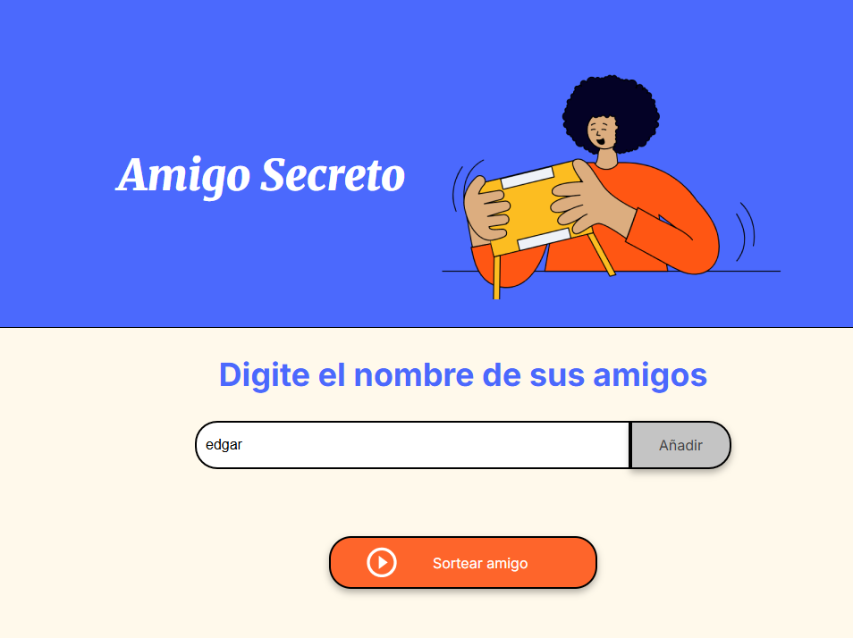
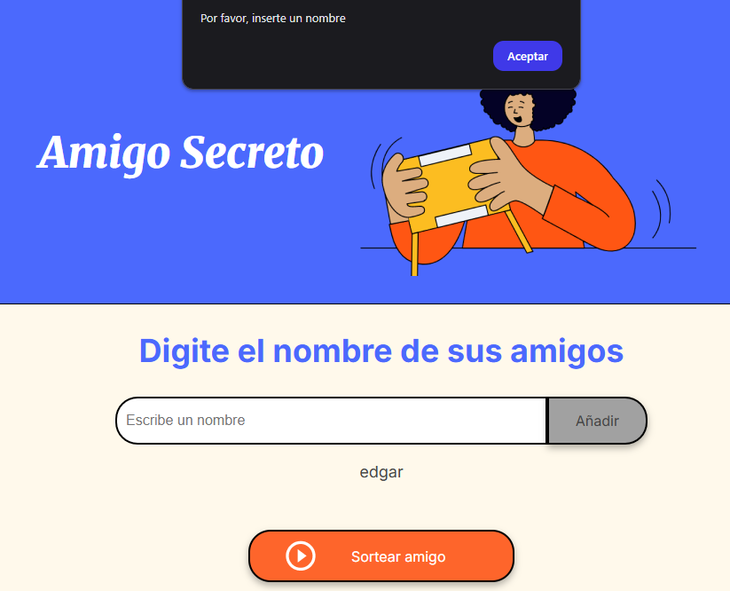
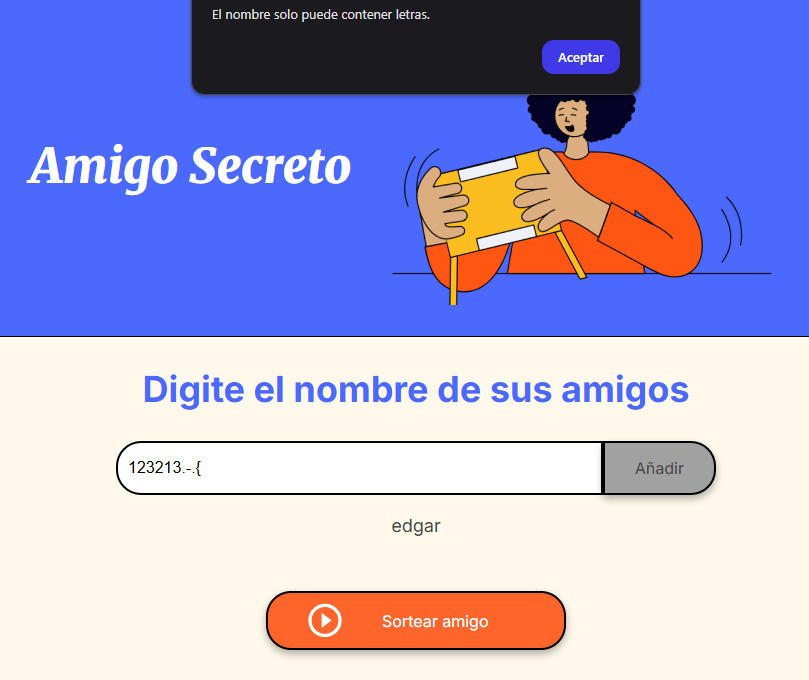
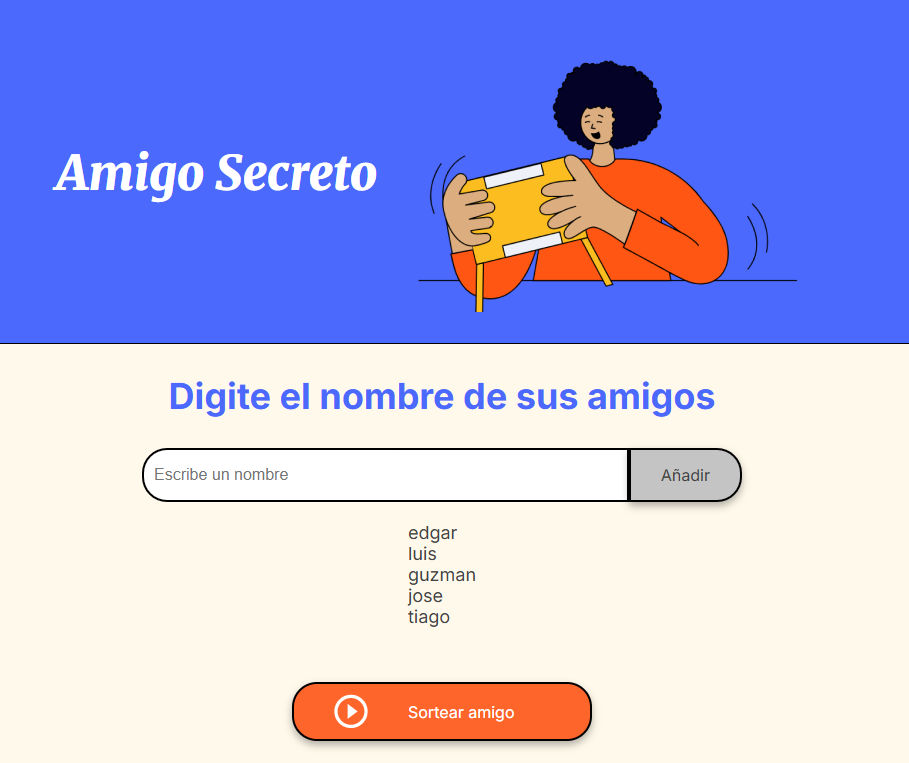
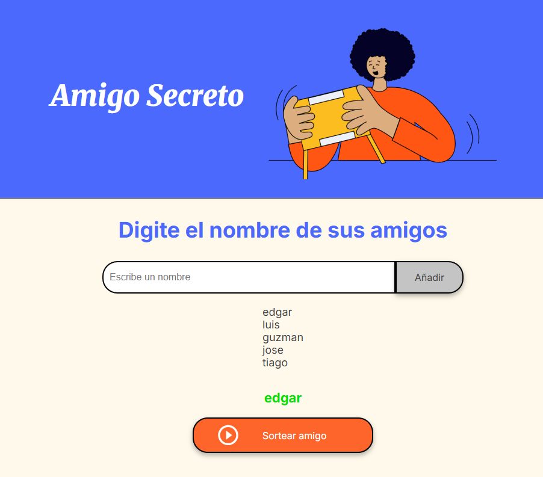

# Challenge Amigo Secreto de Alura

Este proyecto consiste en registrar nombres de amigos para alamcenarlos en una lista que permita realizar un sorteo escogiendo un nombre de manera aleatoria

## Funciones

- **ingresar nombres:** Los usuarios pueden escribir  nombres en un campo de texto y para almacenarlos en  la lista.

   

- **alertas :** si se intenta ingresar numeros, caracteres extraños, duplicar un nombre o si el campo esta vacio el sistema mostrara un mensaje pidiendo que se ingrese nombres.

   
   
   

- 👀**mostrando listas:** Los nombres ingresados aparecerán en una lista actualizada automáticamente debajo del campo de entrada.

   

- 🎲**Sorteo aleatorio:** Al hacer clic en el botón **"Sortear Amigo"**, el sistema seleccionará aleatoriamente un nombre de la lista y lo mostrará en pantalla.

   
